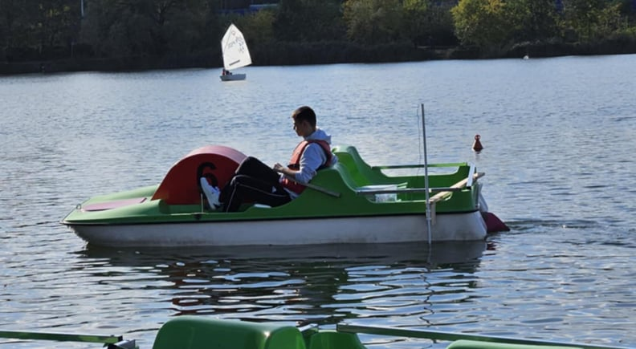
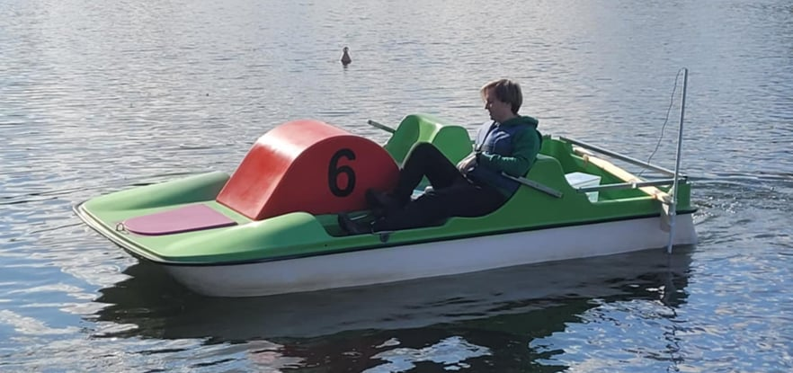
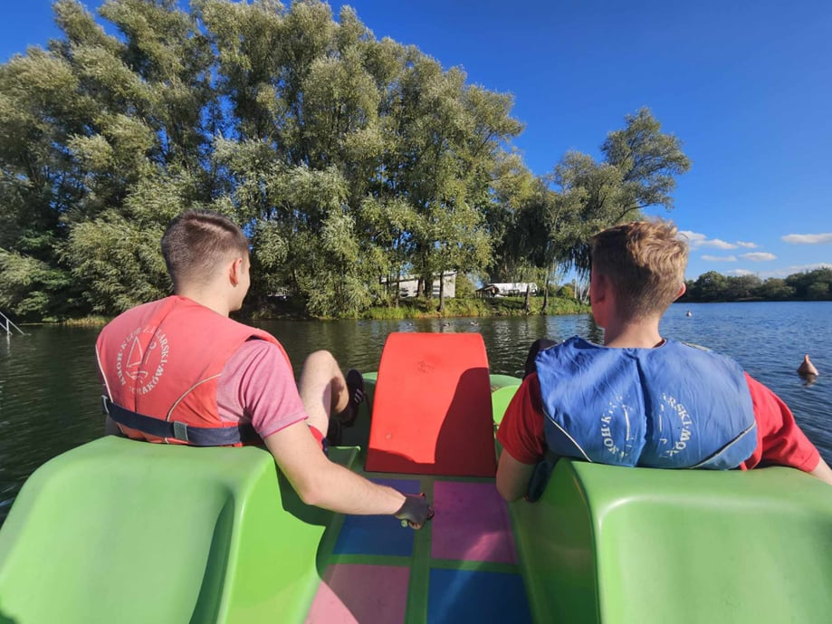
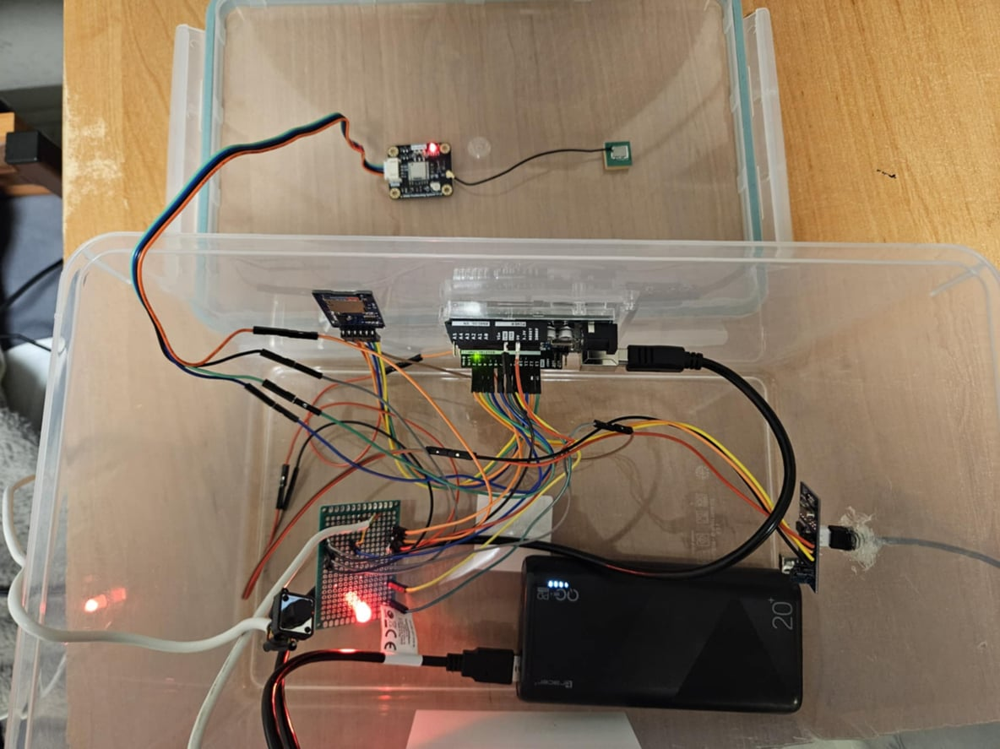
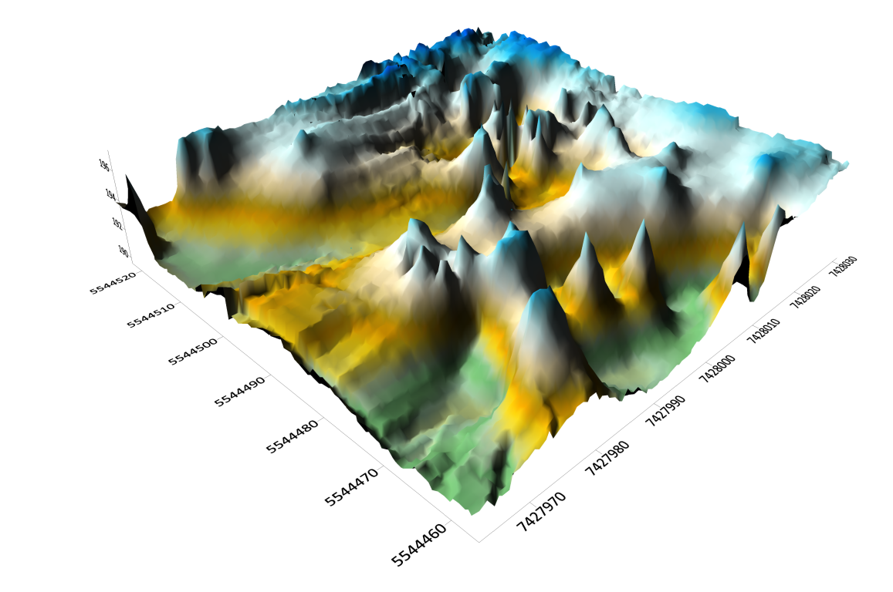
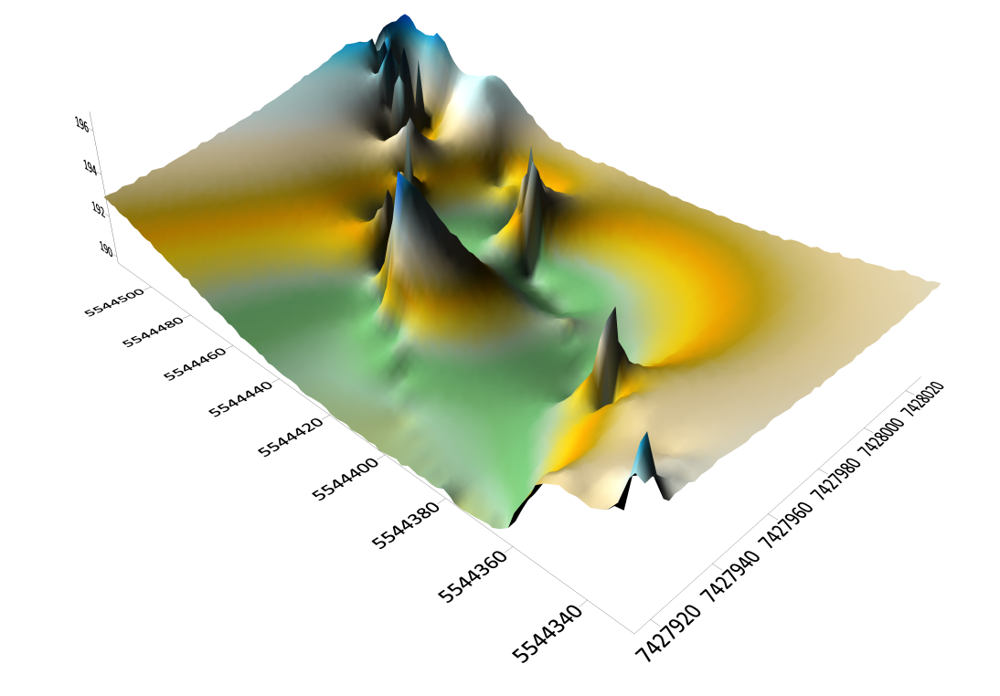

# Grant Rektora 2024 - Pomiary batymetryczne [KNG Dahlta]
  
Jest to repozytorium związane z projektem realizowanym przez Koło Naukowe Geodetów 'Dahlta' jako jeden z Grantów Rektora 2024 [AGH]. Projekt "Program badawczy HydroBIM – część pierwsza: automatyzacja pomiarów batymetrycznych zbiorników wodnych i szlaków żeglugowych" ma na celu zbudowanie prototypu echosondy, po to by sprawdzić nauczyć się podstaw elektroniki oraz sprawdzenie jego dokładności, zarówno wyznaczenia współrzędnych, jak i wyznaczenia głębokości w pomiarach batymetrycznych.

Współczesne badania hydrograficzne i zarządzanie zasobami wodnymi coraz częściej wykorzystują technologie automatyczne do pozyskiwania szczegółowych danych batymetrycznych, które stanowią podstawę analiz topografii dna zbiorników wodnych. Tradycyjne metody pomiaru głębokości, mimo swojej dokładności, są zazwyczaj kosztowne, wymagają specjalistycznego sprzętu oraz wykwalifikowanej obsługi, co ogranicza ich dostępność i praktyczne zastosowanie. W odpowiedzi na te wyzwania, projekt udostępniony w repozytorium na platformie GitHub [1] dąży do stworzenia ekonomicznego i prostego w obsłudze prototypu echosondy, umożliwiającego gromadzenie oraz przetwarzanie danych głębokościowych.

Z myślą o tej możliwości część członków Koła Naukowego Geodetów „Dahlta” opracowało projekt badawczy, zrealizowany jako część Grantu Rektora 2024. Projekt opisany w niniejszym artykule ma na celu opracowanie niskokosztowego, zautomatyzowanego systemu pomiarów batymetrycznych, który dzięki wykorzystaniu prototypu echosondy zintegrowanego z modułem GPS pozwala na rejestrację danych topograficznych dna zbiorników wodnych. W projekcie tym wykorzystano płytkę Arduino, co umożliwia analizę oraz zapis danych w sposób ciągły i autonomiczny dzięki modułowi karty microSD. Dzięki zastosowaniu prototypu echosondy, można generować i odbierać sygnały ultradźwiękowe, które po przetworzeniu dostarczają informacji o głębokości w różnych punktach pomiarowych, jednocześnie zapisując współrzędne geograficzne dla każdej wartości głębokości, a także czas, w którym informacje te zostały pomierzone.

## Moduły wykorzystane w projekcie:
- [Moduł czytnika kart microSD](https://botland.com.pl/akcesoria-do-kart-pamieci/8230-modul-czytnika-kart-microsd-5904422311278.html?cd=18298825138&ad=&kd=&gad_source=1&gclid=Cj0KCQjw4MSzBhC8ARIsAPFOuyV3e0OKvE2_MWXHbHzuE3z-97jvh5oQhjkQfZgNQd0Qb-kYaUrYY7caAhA6EALw_wcB)

- [Moduł odbiornika GNSS GPS DFRobot TEL0157](https://botland.com.pl/moduly-gps/22671-gravity-modul-odbiornika-gnss-gps-beidou-i2cuart-dfrobot-tel0157-6959420923199.html?cd=18298825651&ad=&kd=&gad_source=1&gclid=Cj0KCQjw4MSzBhC8ARIsAPFOuyVK5DkbfYtcIf9Kkr6AhN3Mr3t-RRxih82mm45TOmbRo41qDEjdA6waAuWuEALw_wcB)

- [Moduł ultradźwiękowego czunika odległości JSN-SR04T z sondą wodoodporną](https://botland.com.pl/ultradzwiekowe-czujniki-odleglosci/7266-ultradzwiekowy-czujnik-odleglosci-jsn-sr04t-20-450cm-z-sonda-wodoodporna-5904422310066.html)

## Od czego rozpocząć?

Aby uruchomić program, należy najpierw zainstalować odpowiednie biblioteki:

- **SD** by Arduino, SparkFun v1.2.4
- **DFRobot_GNSS** by DFRobot v1.0.0
- **jsnsr04t** by Overflaw v1.1.0

Wszystko wykonujemy w programie Arduino IDE, w zakładce "Menedżer bibliotek", wpisując powyższe nazwy i klikając "Zainstaluj".

W folderze [**libraries**](https://github.com/szymonzarosa/Echosonda-GrantRektora-KNG_Dahlta/tree/main/libraries) znajdują się niektóre pliki z tych bibliotek.

Jednym z najważniejszych kroków po zainstalowaniu bibliotek jest zmiana wartości METER_CONVERSION_COEFFICIENT w bibliotece jsnsr04t.h. Domyślna wartość wynosząca 58 odpowiada prędkości dźwięku w powietrzu. Jednak podczas korzystania z ultradźwiękowego czujnika w wodzie, prędkość dźwięku jest znacznie wyższa, a zatem wartość ta musi być skorygowana.

Na stronie związanej z czujnikiem [5] można znaleźć taką informację na temat przeliczania pomierzonego czasu tak by dostać wartość odległości:

„Moduł dokonuje pomiaru odległości przy pomocy fali dźwiękowej o częstotliwości 40 kHz. Do mikrokontrolera wysyłany jest sygnał, w którym odległość zależna jest od czasu trwania stanu wysokiego i można ją obliczyć ze wzoru:

test distance = (high level time × velocity of sound (340m/s) / 2

W skrócie, aby otrzymać wynik w cm można wykorzystać wzór:

distance [cm] = ( high level time [us] * 34 ) / 1000 / 2 ”

Aby uzyskać poprawny współczynnik, należy podzielić pierwotną wartość 58 przez około 4,5. W wyniku tego obliczenia uzyskujemy wartość 13, co jest kluczowe dla uzyskania dokładnych pomiarów głębokości.

Wykorzystywane prędkości do przeliczenia współczynnika wynoszą:

- 340 m/s – prędkość poruszania się fali dźwiękowej w powietrzu
- 1500 m/s – prędkość poruszania się fali dźwiękowej w wodzie

Dlaczego jest to ważne? Dokonanie tej zmiany jest niezbędne, ponieważ jeśli współczynnik konwersji nie będzie odpowiednio dostosowany, pomiary głębokości będą niepoprawne, co może prowadzić do błędnych danych i niewłaściwych analiz.

Następnie podpinamy odpowiednio przewody modułów do pinów Arduino Uno w następującej kolejności:

### Moduł GNSS

|   Moduł   |  Arduino  |
|-----------|-----------|
|    RX     |   PIN 5   |
|    TX     |   PIN 4   |

### Moduł Echosondy

|   Moduł   |  Arduino  |
|-----------|-----------|
|  ECHO PIN |   PIN 3   |
|  TRIG PIN |   PIN 2   |

### Moduł Karty SD

|   Moduł   |  Arduino  |
|-----------|-----------|
|    CS     |   PIN 10  |
|   MOSI    |   PIN 11  |
|   MISO    |   PIN 12  |
|    SCK    |   PIN 13  |

### Przycisk i dioda LED

|   Moduł   |   Arduino  |
|-----------|------------|
|   LED_R   |    PIN 9   |
|   LED_G   |    PIN 8   |
|   BUTTON  |    PIN 7   |

Wszystkie moduły zasilane są napięciem 5V.

W folderze [**getGNSS**](https://github.com/szymonzarosa/Echosonda-GrantRektora-KNG_Dahlta/tree/main/getGNSS) znajduje się kod dostosowany do uruchomienia modułu GNSS i weryfikacji poprawności połączenia. Zawiera on dodatkowe komentarze, które tłumaczą poszczególne fragmenty kodu.

W folderze [**NonBlockingWrite**](https://github.com/szymonzarosa/Echosonda-GrantRektora-KNG_Dahlta/tree/main/NonBlockingWrite) znajduje się kod dostosowany do uruchomienia modułu karty SD i weryfikacji poprawności połączenia. Zawiera on dodatkowe komentarze, które tłumaczą poszczególne fragmenty kodu.

W folderze [**ourProject**](https://github.com/szymonzarosa/Echosonda-GrantRektora-KNG_Dahlta/tree/main/ourProject) znajduje się realizowany projekt, który będzie się opierał na powyższych folderach. 

## Pierwsze Uruchomienie

Po prawidłowym podłączeniu komponentów do płytki Arduino oraz jego uruchomieniu, czerwona dioda LED informuje nas, że urządzenie znajduje się w trybie oczekiwania na ustalenie pozycji. Ten kolor oznacza, że moduł GNSS nie uzyskał jeszcze dostępu do wystarczającej liczby satelitów, co jest niezbędne do rozpoczęcia działania echosondy. Zbieranie danych na temat głębokości i pozycji wymaga stabilnego sygnału satelitarnego, dlatego tryb oczekiwania pozostaje aktywny aż do uzyskania połączenia z minimalną liczbą satelitów, co umożliwia wiarygodne i dokładne wyznaczenie pozycji.

Aby pomiary były jak najbardziej precyzyjne, kluczowe jest przeprowadzanie ich w miejscach pozbawionych przeszkód takich jak drzewa, budynki czy inne obiekty terenowe, które mogą zakłócać sygnał satelitarny. Przeszkody tego typu mogą powodować osłabienie lub zniekształcenie sygnału, prowadząc do problemów z ustaleniem dokładnych współrzędnych. Utrudniona widoczność satelitów skutkuje większymi błędami w pomiarze pozycji i, w rezultacie, wpływa na wiarygodność odczytów głębokości.

Po uzyskaniu stabilnego połączenia z wystarczającą liczbą satelitów dioda LED zmienia kolor na żółty, co oznacza, że system jest gotowy do działania, jednak wymaga jeszcze interakcji ze strony użytkownika. Kolor żółty sygnalizuje, że moduł GNSS ustalił już pozycję, ale system wymaga potwierdzenia rozpoczęcia pomiarów poprzez naciśnięcie przycisku. Dopiero ten krok umożliwia pełną aktywację systemu.

Gdy użytkownik naciśnie przycisk, dioda zmienia kolor na zielony, co sygnalizuje przejście systemu w tryb aktywnego pomiaru. W tym trybie moduł GNSS przeprowadza pomiary w stałych odstępach co 4 sekundy, zbierając dane na temat pozycji oraz głębokości.

Taki trójfazowy system sygnalizacji za pomocą kolorów LED nie tylko ułatwia użytkownikowi zrozumienie aktualnego stanu urządzenia, ale także zwiększa niezawodność procesu pomiarowego, umożliwiając szybkie rozpoznanie ewentualnych problemów przed rozpoczęciem właściwych pomiarów.

## Wyniki po pierwszym uruchomieniu

Przykładowy wynik pomiaru znajduje się w folderze **output** jako plik o nazwie *hour_minute_second.csv*.

Plik składa się z następujących danych: *year*, *month*, *day*, *hour*, *minute*, *second*, *latDirection*, *lonDirection*, *latitude*, *longitude*, *latDegree*, *lonDegree*, *depth*, *high*, *starID*, *sog*, *cog*.

Poniżej znajduje się szczegółowy opis zapisywanych danych:

- year:  Rok pomiaru.
- month:  Miesiąc pomiaru.
- day:  Dzień pomiaru.
- hour:  Godzina pomiaru.
- minute:  Minuta pomiaru.
- second:  Sekunda pomiaru.
- latDirection:  Kierunek szerokości geograficznej (N – północ, S – południe).
- lonDirection:  Kierunek długości geograficznej (E – wschód, W – zachód).
- latitude:  Szerokość geograficzna w formacie dziesiętnym.
- longitude:  Długość geograficzna w formacie dziesiętnym.
- latDegree:  Szerokość geograficzna w stopniach.
- lonDegree:  Długość geograficzna w stopniach.
- depth:  Głębokość zmierzona przez echosondę zapisywana w centymetrach.
- high:  Wysokość nad poziomem morza.
- starID:  Liczba widzianych satelit.
- sog:  Prędkość statku przez wodę (Speed Over Ground).
- cog:  Kurs statku przez wodę (Course Over Ground).

W kontekście analizowanych danych, kluczowe znaczenie ma parametr depth, którego interpretacja wymaga szczególnej uwagi. W przypadku, gdy zmienna przyjmuje wartość ujemną, jest to jednoznaczny sygnał, że głębokość przekroczyła maksymalny zakres detekcji dostępny dla zastosowanego modułu pomiarowego jakim jest ultradźwiękowy czujnik odległości. Taka sytuacja wskazuje na brak możliwości uzyskania wiarygodnych danych na temat rzeczywistej głębokości. Możliwe przyczyny tego ograniczenia obejmują nie tylko nadmierną głębokość zbiornika, ale również obecność czynników środowiskowych zakłócających odbiór sygnału, takich jak duże zagęszczenie cząsteczek w toni wodnej, odbicia od struktur podwodnych, czy interferencje związane z zasoleniem i temperaturą wody.

Początkowy zakres głębokości wykrywanych przez system wynosił od 20 cm do 450 cm. Jednakże, istotna jest tu konieczność uwzględnienia korekty wynikającej ze zmiany wartości współczynnika w zastosowanej bibliotece, co modyfikuje zakres operacyjny czujnika. Po aktualizacji współczynników pomiarowych, zakres pomiaru głębokości przez zastosowany czujnik wodny wynosi od 0,90 metra do 20,25 metra. Ta modyfikacja jest kluczowa, ponieważ pozwala na precyzyjne rozszerzenie zakresu pomiarowego, co umożliwia pomiar głębokości w szerszym spektrum środowisk wodnych.

Takie podejście jest niezwykle istotne dla zapewnienia wysokiej jakości danych, ponieważ każda wartość spoza tego zakresu, w szczególności ujemna wartość distance, powinna być traktowana jako błędna. W związku z tym, ujemne wartości stanowią wskaźnik problemów z odczytem i wymagają dodatkowej analizy lub korekty metodologicznej, aby uniknąć błędnych interpretacji wyników pomiarów w projektach hydrograficznych i badaniach środowiskowych.

## Zamiana rozszerzenia pliku csv na gpx

W celu monitorowania oraz analizy dokładności wyznaczenia położenia punktów GPS, stworzono kod w dwóch językach programowania: MATLAB oraz Python. Kod ten umożliwia efektywne przetwarzanie oraz konwersję danych przestrzennych zapisanych w plikach CSV (Comma-Separated Values), które przechowywane są na karcie microSD. Pliki CSV zawierają surowe dane współrzędnych geograficznych, takich jak szerokość i długość geograficzna, które stanowią podstawę analizy i wizualizacji ścieżek pomiarowych.

Głównym celem kodu jest konwersja danych z formatu CSV do formatu GPX (GPS Exchange Format). Format GPX jest szeroko stosowany do zapisu śladów GPS, co pozwala na ich analizę oraz wizualizację na platformach mapowych online. W szczególności, format GPX jest kompatybilny z takimi narzędziami jak [gpx.studio](https://gpx.studio/), które umożliwiają szczegółowe odwzorowanie tras oraz analizę przestrzenną wybranych punktów na mapie. Tego typu wizualizacja jest nieoceniona w monitorowaniu dokładności systemu GPS, umożliwiając szczegółowy przegląd oraz porównanie przebytej trasy z przewidywanymi punktami odniesienia.

Przykładowy plik po konwersji **output.gpx** oraz kod do zamiany rozszerzenia pliku **python_file_csv_to_gpx.py** znajduje się w folderze [**gpx_trajectory**](https://github.com/szymonzarosa/Echosonda-GrantRektora-KNG_Dahlta/tree/main/gpx_trajectory)

## Pomiar referencyjny punktów znajdujących się przy brzegu

Przeprowadzono kompleksowy pomiar 12 punktów referencyjnych zlokalizowanych na powierzchni wody oraz dwóch punktów osnowy pomiarowej w bliskim sąsiedztwie badanego zbiornika wodnego. Do realizacji pomiarów wykorzystano technologię GNSS, przy czym na każdym punkcie referencyjnym wykonano dwie serie pomiarowe, trwające po 1 sekundzie. Głównym celem pomiarów na punktach referencyjnych było określenie przewyższenia, umożliwiającego obliczenie głębokości zanurzenia danego punktu względem ustalonego poziomu odniesienia. Biorąc pod uwagę planowany poziom dokładności, uznano, że tak krótki czas pomiarowy na każdy punkt (1 sekunda) jest wystarczający, ponieważ uzyskane błędy liniowe (dx, dy) oraz wysokościowe (dh) oscylowały w granicach 1 cm, co mieściło się w akceptowalnych tolerancjach dla zakładanych założeń badawczych.

W zakresie weryfikacji dokładności wyznaczenia wartości współrzędnych płaskich dla osnowy pomiarowej, wykonano dodatkowe pomiary na dwóch punktach osnowy, których lokalizacja znajdowała się w niewielkiej odległości od badanego zbiornika. Pomiar na punktach osnowy trwał po cztery minuty, co pozwoliło na zminimalizowanie wpływu ewentualnych błędów systematycznych i losowych oraz umożliwiło uzyskanie bardziej stabilnych i precyzyjnych wyników w zakresie współrzędnych płaskich.

Ponadto, w celu oceny i uwiarygodnienia wyników, na 12 punktach referencyjnych zastosowano prototyp urządzenia pomiarowego. Każdy pomiar realizowany prototypem trwał jedną minutę, co pozwoliło na zebranie odpowiedniej liczby danych obserwacji do dalszej analizy porównawczej. Po zakończeniu pomiarów wszystkie dane zostały poddane procedurze uśredniania, a następnie zestawione z wynikami uzyskanymi przy użyciu odbiornika GNSS. Takie podejście umożliwiło przeprowadzenie analizy różnicowej pomiędzy wynikami uzyskanymi z zastosowaniem różnych technik pomiarowych, co stanowi cenny wkład w ocenę wiarygodności i precyzji zastosowanego prototypu oraz odbiornika GNSS.

## Wyniki pomiaru referencyjnego 

Poniżej przedstawiam zestawienie pomierzonych głębokości przez GNSS z odbiornika oraz z czujnika.

|    Nr   |     fi      |    lambda   |  g (czujnik)  |   g (odbiornik)   |   delta g  |
|---------|-------------|-------------|---------------|-------------------|------------|
|   101   |  50.032675  |  19.994729  |     1.12      |        0.84       |    0.28    |
|   103   |  50.032648  |  19.994717  |     1.12      |        1.08       |    0.04    |
|   105   |  50.032618  |  19.994733  |     1.92      |        1.91       |    0.01    |
|   107   |  50.032586  |  19.994790  |     1.79      |        1.84       |   -0.06    |
|   109   |  50.032590  |  19.994800  |     1.14      |        1.25       |   -0.11    |
|   111   |  50.032625  |  19.994821  |     1.12      |        0.67       |    0.45    |
|   113   |  50.032621  |  19.994871  |     1.12      |        1.08       |    0.04    |
|   115   |  50.032600  |  19.994960  |     1.12      |        1.11       |    0.02    |
|   117   |  50.032583  |  19.995028  |     1.13      |        1.09       |    0.04    |
|   119   |  50.032578  |  19.995033  |     1.12      |        1.14       |   -0.02    |
|   121   |  50.032561  |  19.995103  |     1.12      |        1.07       |    0.05    |
|   123   |  50.032538  |  19.995187  |     1.11      |        1.05       |    0.07    |

Jak można zauważyć, ciężko jest stwierdzić na ile dokładnie czujnik sprawdza się przy swojej granicznej możliwej do zmierzenia odległości - ok. 1.00 metra. Natomiast można wnioskować, że jeśli ta wartość jest bliższa 2 metrów, to dokładność czujnika jest dość przyzwoita.

Dokładność położenia punktu - współrzędne płaskie (X,Y)

ODBIORNIK GNSS i	ECHOSONDA	PORÓWNANIE
	       (UKŁAD PL-2000)            

 

|  PKT	|       X        |      	Y      |	 PKT  |     	X        |	     Y	       |  DELTA X	  | DELTA Y	 |   DELTA D  |
|-------|----------------|---------------|--------|----------------|-----------------|------------|----------|------------|
|  101  |	 5544536,012	 |  7427982,015  |	 1    | 	5544538,784  |	 7427981,379   |  	-2,772  |	 0,636	 |    2,844   |
|  103  |	 5544532,966	 |  7427980,964  | 	 2   	|   5544535,737  |   7427980,519	 |   -2,771	  |  0,445	 |    2,807   |
|  105  |	 5544529,980   |  7427980,037	 |   3   	|   5544532,374  |	 7427981,578	 |   -2,394   | -1,541	 |    2,847   |
|  107  |  5544528,668	 |  7427983,896  |	 4    |	  5544528,775	 |   7427985,591   |	  -0,107 	| -1,695	 |    1,698   |
|  109  |	 5544531,595	 |  7427984,902  |	 5    |	  5544529,236  |	 7427986,351	 |    2,359	  | -1,449	 |    2,768   |
|  111  |	 5544534,091	 |  7427985,609  |	 6    |	  5544533,088	 |   7427987,868	 |    1,003	  | -2,259	 |    2,472   |
|  113  |  5544532,349	 |  7427990,233  |	 7	  |   5544532,671  |	 7427991,459	 |   -0,322	  | -1,226	 |    1,268   |
|  117  |  5544528,403	 |  7428001,172  |	 9    |	  5544528,211	 |   7428002,676	 |    0,192	  | -1,504   | 	  1,516   |
|  119  |  5544527,799	 |  7428002,707  |	 10  	|   5544527,676	 |   7428003,046	 |    0,123	  | -0,339	 |    0,361   |
|  121  |	 5544525,873	 |  7428007,894  |	 11  	|   5544525,758  |	 7428008,032	 |    0,115	  | -0,138	 |    0,180   |
|  123  |	 5544524,166	 |  7428012,583  |	 12   |  	5544523,054	 |   7428013,986	 |    1,112	  | -1,403	 |    1,790   |

Średnia odchyłka to	1,863 metra. Przy założeniu, że pojedynczy pomiar GNSS z echosondy to około 2 metry, to przy pomiarze 1-minutowym nad jednym punktem to dobry, ale i spodziewany wynik. Należy też zauważyć, że wraz z mijaniem czasu od inicjalizacji zbierania informacji, wyniki dokładności położenia punktów, a tym samym wartości bezwględne odchyłek od pomiaru odbiornikiem GNSS malały.

Dokładność położenia punktu - współrzędne płaskie (X,Y)

ODBIORNIK GNSS i	ECHOSONDA	PORÓWNANIE
	       (UKŁAD PL-2000)         

  

|  PKT	 |       X         |      	Y      |	 PKT      |     	X        |	     Y	       |  DELTA X	  | DELTA Y	 |   DELTA D  |
|--------|-----------------|---------------|------------|----------------|-----------------|------------|----------|------------|
|  5001  |	 5544537,553	 |  7427986,918  |	 5001S    | 	5544537,196  |	 7427988,874   |  	0,357   |	 -1,956	 |    1,988   |
|  5000  |	 5544523,970	 |  7428014,844  |	 5000S    | 	5544524,239  |	 7428015,908   |   -0,269   |	 -1,064	 |    1,097   |

Tutaj natomiast mierzono punkty osnowy. Czas pomiaru echosondą nad jednym punktem wynosił 4 minuty. Jak można zzauważyć - musimy poczekać chwilę od inicjalizacji urządzenia, by dokładność wyznaczenia współrzędnych była większa.

## Pomiar batymetryczny

Pomiar batymetryczny przeprowadzono przy użyciu roweru wodnego, na którym zamontowano konstrukcję dla czujnika głębokości. Do jednej strony pojazdu wodnego przymocowano deskę z uchwytami, wykorzystując rurkę PCV jako prowadnicę dla kabla pochodzącego z modułu ultradźwiękowego czujnika odległości. Konstrukcja ta została zabezpieczona i ustabilizowana za pomocą taśmy montażowej, co zapewniło trwałość połączenia i ochronę przed przemieszczaniem się czujnika podczas ruchu roweru po wodzie.

Cały system pomiarowy, w tym prototyp urządzenia został umieszczony w wodoodpornym pudełku, które zlokalizowano na tylnym siedzeniu roweru wodnego. Taka lokalizacja urządzenia pozwoliła na łatwy dostęp do elementów systemu oraz efektywne zarządzanie procesem pomiarowym.
Poniżej zdjęcia:

A tak wygląda prototyp w środku plastikowego pudełka:

## Wyniki pomiaru batymetrycznego

Po analizie wykonananych obserwacji z pomiaru batymetrycznego wykonaliśmy mapy 3D. Jedna z nich, to część zbiornika zalewowego Bagry przy Klubie Żeglarskim Horn, a druga miała na celu sprawdzenie, jaką największą głębokość uda nam się pomierzyć (było to około 7,50 metra). Poniżej znajdują się opracowania.

Po analizie opracować kartograficznych doszliśmy do wniosku, by spróbować pozbyć się tak zwanych "peak'ów", czyli bardzo prawdopodobnie błędnych wyników pomiaru, np. gdy głębokość jest znaczna, a czujnik pokazuje głębokość możliwie najniższą przez niego uzyskiwaną. Poniżej wynik poprawy uzyskanych opracowań w postaci załączonych zdjęć.

## Dodatkowe linki

Polecane poradniki do modułu Czytnika kart microSD:
- [Arduino SD Library Reference](https://www.arduino.cc/reference/en/libraries/sd/)
- [Zapisywanie danych z czujnika na karcie SD w systemie Arduino](https://mikrokontroler.pl/2022/06/15/zapisywanie-danych-z-czujnika-na-karcie-sd-w-systemie-arduino/)

Polecane poradniki do modułu odbiornika GPS:
- [Gravity GNSS Positioning Module](https://wiki.dfrobot.com/SKU_TEL0157_Gravity_GNSS_Positioning_Module)
- [DFRobot GNSS GitHub Repository](https://github.com/DFRobot/DFRobot_GNSS)

Polecane poradniki do modułu Echosondy:
- [Pomiar odległości z wykorzystaniem Arduino i czujnika HC-SR04](https://botland.com.pl/content/144-pomiar-odleglosci-z-wykorzystaniem-arduino-i-czujnika-hc-sr04-lub-us-015)
