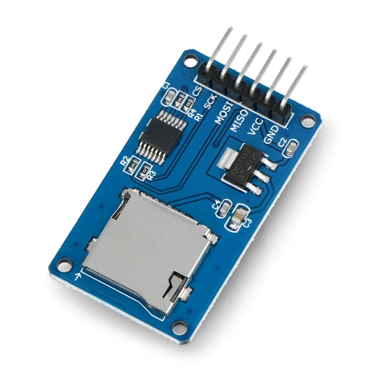
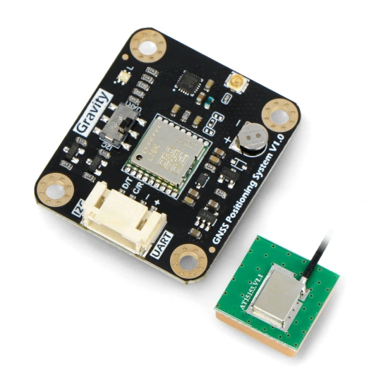
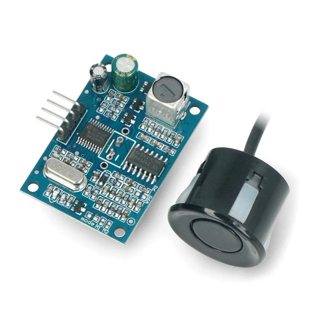
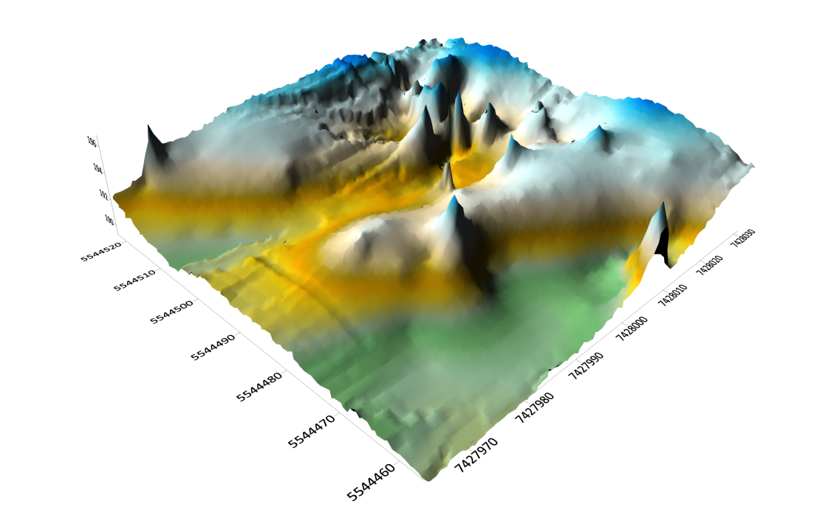
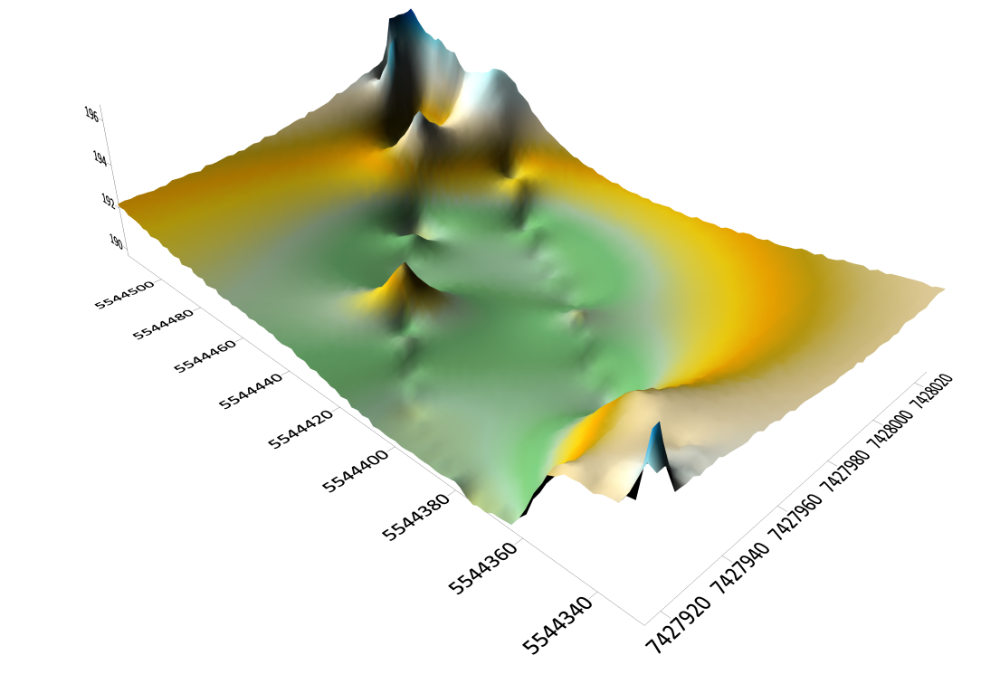

# Rector's Grant 2024 - Bathymetric Measurements [KNG Dahlta]
This repository contains materials related to the project implemented by the **"Dahlta" Student Scientific Group** as part of the AGH University Rector's Grant 2024 competition. The project, titled *"HydroBIM Research Program – Part One: Automation of Bathymetric Measurements of Water Reservoirs and Navigation Channels,"* aims to construct a prototype echo sounder to learn the basics of electronics and verify its accuracy — both in terms of coordinate determination and depth measurement in bathymetric surveys.

## Project Overview

Modern hydrographic surveys and water resource management increasingly rely on automated technologies to acquire detailed bathymetric data. Traditional depth measurement methods, while accurate, are often costly and require specialized equipment and skilled personnel. In response to these challenges, this project aims to create an economical and easy-to-use **Single Beam Echo Sounder (SBES)** prototype.

The system is based on an **Arduino** platform, integrated with a **GNSS module** and an **ultrasonic sensor**. It allows for the continuous, autonomous recording of:
* Depth (distance to the bottom),
* Geographic coordinates (latitude/longitude),
* Precise timestamp for each measurement.

The solution fits into the "Citizen Science" trend, democratizing access to spatial data for shallow inland water bodies.

## Hardware Components

The following modules were used to build the prototype:

**MicroSD Card Reader Module**
    * [Link to store](https://botland.com.pl/akcesoria-do-kart-pamieci/8230-modul-czytnika-kart-microsd-5904422311278.html)
     

**GNSS Receiver Module: DFRobot TEL0157 (GPS/BeiDou/GLONASS)**
    * [Link to store](https://botland.com.pl/moduly-gps/22671-gravity-modul-odbiornika-gnss-gps-beidou-i2cuart-dfrobot-tel0157-6959420923199.html)
     

**Ultrasonic Distance Sensor: JSN-SR04T (Waterproof Probe)**
    * [Link to store](https://botland.com.pl/ultradzwiekowe-czujniki-odleglosci/7266-ultradzwiekowy-czujnik-odleglosci-jsn-sr04t-20-450cm-z-sonda-wodoodporna-5904422310066.html)
     

## Getting Started

### 1. Library Installation

To run the software, install the following libraries via the Arduino IDE "Library Manager":

* **SD** by Arduino, SparkFun (v1.2.4)
* **DFRobot_GNSS** by DFRobot (v1.0.0)
* **jsnsr04t** by Overflaw (v1.1.0)

Relevant files from these libraries can also be found in the [**libraries**](https://github.com/szymonzarosa/Echosonda-GrantRektora-KNG_Dahlta/tree/main/libraries) folder of this repository.

### 2. Calibrating the Speed of Sound

One of the most critical steps is adjusting the `METER_CONVERSION_COEFFICIENT` in the `jsnsr04t.h` library file.
* **Default value (58):** Corresponds to the speed of sound in **air** (~343 m/s).
* **Required value (13):** Corresponds to the speed of sound in **water** (~1482 m/s).

**Why is this necessary?**
The sensor measures the time of flight of the acoustic wave. Since sound travels approx. 4.3 times faster in water than in air, using the default coefficient would result in incorrect depth readings.
$$\text{Distance} = \frac{\text{Time} \times \text{Speed of Sound}}{2}$$
By changing the coefficient to **13**, we calibrate the sensor for the aquatic environment, ensuring measurement accuracy within a few centimeters.

### 3. Wiring Diagram

Connect the modules to the Arduino Uno pins as follows:

**GNSS Module**
| Module | Arduino |
| :---: | :---: |
| RX | PIN 5 |
| TX | PIN 4 |

**Echo Sounder (Ultrasonic Sensor)**
| Module | Arduino |
| :---: | :---: |
| ECHO | PIN 3 |
| TRIG | PIN 2 |

**SD Card Module**
| Module | Arduino |
| :---: | :---: |
| CS | PIN 10 |
| MOSI | PIN 11 |
| MISO | PIN 12 |
| SCK | PIN 13 |

**User Interface (LEDs & Button)**
| Module | Arduino |
| :---: | :---: |
| LED_R (Red) | PIN 9 |
| LED_G (Green) | PIN 8 |
| BUTTON | PIN 7 |

*All modules are powered by 5V.*

## Source Code Structure

* [**getGNSS**](https://github.com/szymonzarosa/Echosonda-GrantRektora-KNG_Dahlta/tree/main/getGNSS): Code for initializing the GNSS module and verifying connections.
* [**NonBlockingWrite**](https://github.com/szymonzarosa/Echosonda-GrantRektora-KNG_Dahlta/tree/main/NonBlockingWrite): Code for initializing the SD card module.
* [**src**](https://github.com/szymonzarosa/Echosonda-GrantRektora-KNG_Dahlta/tree/main/src): **The main project code**, integrating all modules for field measurements.

## Operation & LED Indicators

The system uses a 3-color status indication system:

1.  **Red LED:** **Waiting for Satellite Fix.**
    The device is acquiring signals from satellites. *Note: For best accuracy, a warm-up time of about 6 minutes is recommended.*
2.  **Yellow LED:** **Ready / Standby.**
    A stable fix has been obtained. The system is ready to start. Press the **BUTTON** to begin recording.
3.  **Green LED:** **Measurement in Progress.**
    The system records position and depth data to the SD card every 4 seconds.

## Data Output

The results are saved in the `data_samples` folder as `hour_minute_second.csv`. The file structure includes:

* **Date/Time:** `year`, `month`, `day`, `hour`, `minute`, `second`
* **Coordinates:** `latitude`, `longitude` (decimal and degrees), plus directions (`latDirection`, `lonDirection`)
* **Bathymetry:**
    * `depth`: Measured depth in cm.
    * *Note:* **Negative depth values** indicate measurement errors or that the bottom is out of range (the sensor has a "dead zone" below ~0.9m and a max range of ~20m after calibration).
* **GNSS Metadata:** `high` (altitude), `starID` (satellite count), `sog` (speed over ground), `cog` (course over ground).

### Data Conversion (CSV to GPX)
To visualize the trajectory on maps (e.g., via [gpx.studio](https://gpx.studio/)), we provided scripts to convert raw CSV data into GPX format.
* Scripts available in: [**gpx_trajectory**](https://github.com/szymonzarosa/Echosonda-GrantRektora-KNG_Dahlta/tree/main/gpx_trajectory) (Python and MATLAB versions available).

## Accuracy Verification Results

### Horizontal Accuracy (GNSS)
Verified against a geodetic receiver (Leica GS16).
* **Mean deviation:** ~1.86 m.
* *Observation:* Accuracy improves significantly after the initialization/warm-up period.

### Vertical Accuracy (Depth)
Verified against manual measurements (reference pole) at 12 control points.
* **Accuracy:** The system achieved a mean error of **4-7 cm** in the 1.00 - 2.00 m depth range.
* **Standards:** This result falls within the **IHO S-44 Order 1b** vertical uncertainty limits.
* **Limitations:** The sensor exhibits a "dead zone" below 0.90 m, where measurements are unstable or impossible.

**3D Bathymetric Models:**
Below are visualizations of the Bagry reservoir bed generated from the prototype data:

(Spikes and artifacts were removed during post-processing to improve model quality).*

## 💰 Funding & Acknowledgments

This project was funded and realized as part of the **AGH University Rector’s Grant for Student Scientific Groups 2024** (Project No: **40/GRANT/2024**).

[cite_start]**Project Title:** *"HydroBIM Research Program – Part One: Automation of Bathymetric Measurements of Water Reservoirs and Navigation Channels"*.

Realized by members of the **Science Club of Surveyors "Dahlta"** (KNG Dahlta).

## Useful Links & References

* **MicroSD:** [Arduino SD Library Reference](https://www.arduino.cc/reference/en/libraries/sd/)
* **GNSS:** [DFRobot GNSS Wiki](https://wiki.dfrobot.com/SKU_TEL0157_Gravity_GNSS_Positioning_Module)
* **Ultrasonic Sensor:** [HC-SR04 / JSN-SR04T Tutorial](https://botland.com.pl/content/144-pomiar-odleglosci-z-wykorzystaniem-arduino-i-czujnika-hc-sr04-lub-us-015)
