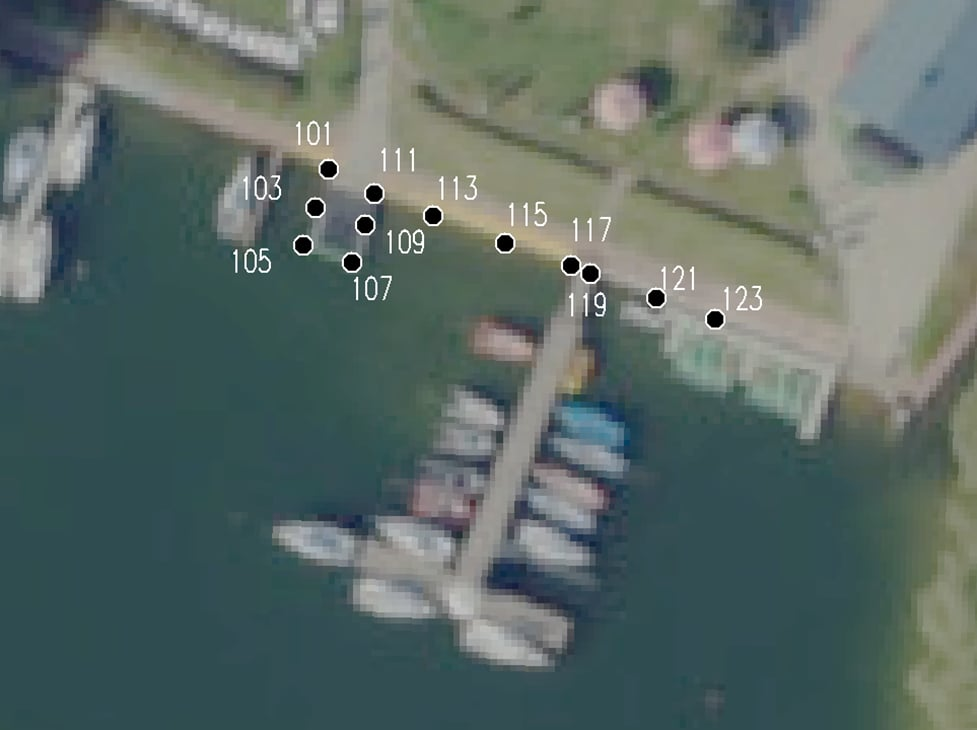
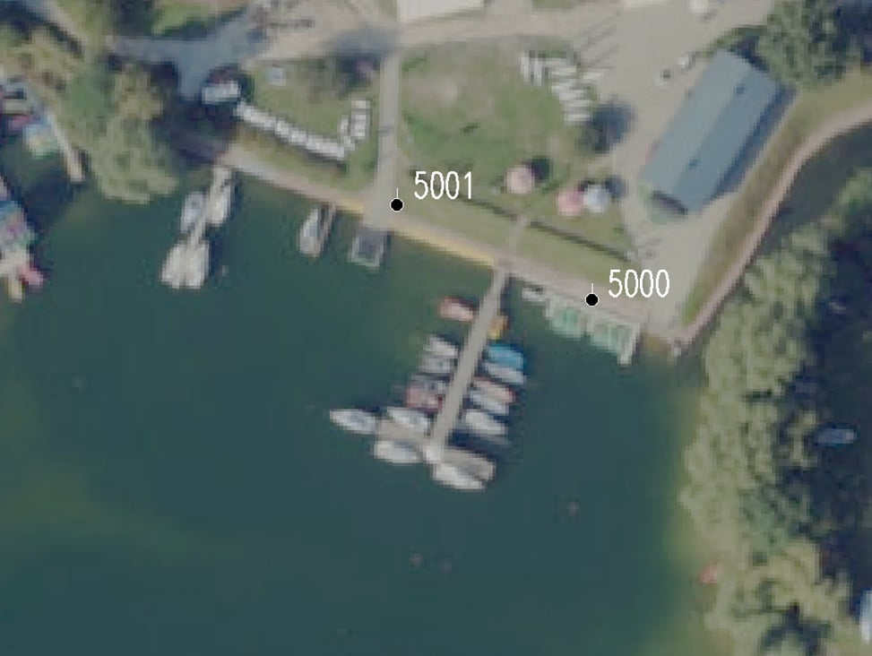

# Grant Rektora 2024 - Pomiary batymetryczne [KNG Dahlta]
  
Jest to repozytorium związane z projektem realizowanym przez Koło Naukowe Geodetów 'Dahlta' jako jeden z Grantów Rektora 2024 [AGH]. Projekt "Program badawczy HydroBIM – część pierwsza: automatyzacja pomiarów batymetrycznych zbiorników wodnych i szlaków żeglugowych" ma na celu zbudowanie prototypu echosondy, po to by sprawdzić nauczyć się podstaw elektroniki oraz sprawdzenie jego dokładności, zarówno wyznaczenia współrzędnych, jak i wyznaczenia głębokości w pomiarach batymetrycznych.

## Moduły wykorzystane w projekcie:
- [Moduł czytnika kart microSD](https://botland.com.pl/akcesoria-do-kart-pamieci/8230-modul-czytnika-kart-microsd-5904422311278.html?cd=18298825138&ad=&kd=&gad_source=1&gclid=Cj0KCQjw4MSzBhC8ARIsAPFOuyV3e0OKvE2_MWXHbHzuE3z-97jvh5oQhjkQfZgNQd0Qb-kYaUrYY7caAhA6EALw_wcB)

- [Moduł odbiornika GNSS GPS DFRobot TEL0157](https://botland.com.pl/moduly-gps/22671-gravity-modul-odbiornika-gnss-gps-beidou-i2cuart-dfrobot-tel0157-6959420923199.html?cd=18298825651&ad=&kd=&gad_source=1&gclid=Cj0KCQjw4MSzBhC8ARIsAPFOuyVK5DkbfYtcIf9Kkr6AhN3Mr3t-RRxih82mm45TOmbRo41qDEjdA6waAuWuEALw_wcB)

- [Moduł ultradźwiękowego czunika odległości JSN-SR04T z sondą wodoodporną](https://botland.com.pl/ultradzwiekowe-czujniki-odleglosci/7266-ultradzwiekowy-czujnik-odleglosci-jsn-sr04t-20-450cm-z-sonda-wodoodporna-5904422310066.html)

## Od czego rozpocząć?

Aby uruchomić program, należy najpierw zainstalować odpowiednie biblioteki:

- **SD** by Arduino, SparkFun v1.2.4
- **DFRobot_GNSS** by DFRobot v1.0.0
- **jsnsr04t** by Overflaw v1.1.0

Wszystko wykonujemy w programie Arduino IDE, w zakładce "Menedżer bibliotek", wpisując powyższe nazwy i klikając "Zainstaluj".

W folderze [**libraries**](https://github.com/szymonzarosa/Echosonda-GrantRektora-KNG_Dahlta/tree/main/libraries) znajdują się niektóre pliki z tych bibliotek. Najważniejszą rzeczą, którą
musieliśmy zrobić to w pliku **jsnsr04t.h** zmienić wartość METER_CONVERSION_COEFFICIENT na wartość 13, gdyż początkowa wartość 58 była właściwa dla poruszania się dźwięku w powietrzu.
My natomiast używając ultradźwiękowego czujnika w wodzie, musieliśmy podzielić ten współczynnik około 4,5 razy, więc jego wartość powinna wynieść 13.

Następnie podpinamy odpowiednio przewody modułów do pinów Arduino Uno w następującej kolejności:

### Moduł GNSS

|   Moduł   |  Arduino  |
|-----------|-----------|
|    RX     |   PIN 5   |
|    TX     |   PIN 4   |

### Moduł Echosondy

|   Moduł   |  Arduino  |
|-----------|-----------|
|  ECHO PIN |   PIN 3   |
|  TRIG PIN |   PIN 2   |

### Moduł Karty SD

|   Moduł   |  Arduino  |
|-----------|-----------|
|    CS     |   PIN 10  |
|   MOSI    |   PIN 11  |
|   MISO    |   PIN 12  |
|    SCK    |   PIN 13  |

### Przycisk i dioda LED

|   Moduł   |   Arduino  |
|-----------|------------|
|   LED_R   |    PIN 9   |
|   LED_G   |    PIN 8   |
|   BUTTON  |    PIN 7   |

Wszystkie moduły zasilane są napięciem 5V.

W folderze [**getGNSS**](https://github.com/szymonzarosa/Echosonda-GrantRektora-KNG_Dahlta/tree/main/getGNSS) znajduje się kod dostosowany do uruchomienia modułu GNSS i weryfikacji poprawności połączenia. Zawiera on dodatkowe komentarze, które tłumaczą poszczególne fragmenty kodu.

W folderze [**NonBlockingWrite**](https://github.com/szymonzarosa/Echosonda-GrantRektora-KNG_Dahlta/tree/main/NonBlockingWrite) znajduje się kod dostosowany do uruchomienia modułu karty SD i weryfikacji poprawności połączenia. Zawiera on dodatkowe komentarze, które tłumaczą poszczególne fragmenty kodu.

W folderze [**ourProject**](https://github.com/szymonzarosa/Echosonda-GrantRektora-KNG_Dahlta/tree/main/ourProject) znajduje się realizowany projekt, który będzie się opierał na powyższych folderach. 

## Pierwsze Uruchomienie

Po poprawnym podłączeniu komponentów i uruchomieniu płytki, dioda świeci na czerwono do momentu uzyskania rozwiązania pozycji oraz połączenia z odpowiednią liczbą satelitów. Jest kluczowe, aby przeprowadzać pomiary na terenach, gdzie nie ma przeszkód widokowych, takich jak drzewa czy budynki, które mogłyby blokować sygnał satelitarny i wpływać na jego jakość.

Gdy moduł GNSS nawiąże połączenie z satelitami, dioda zmienia kolor na żółty, co sygnalizuje potrzebę naciśnięcia przycisku. Po naciśnięciu przycisku, dioda zmienia się na zieloną i rozpoczyna regularne wykonywanie pomiarów co 2 sekundy.

## Wyniki po pierwszym uruchomieniu

Przykładowy wynik pomiaru znajduje się w folderze **output** jako plik o nazwie *hour_minute_second.csv*.

Plik składa się z następujących danych: *year*, *month*, *day*, *hour*, *minute*, *second*, *latDirection*, *lonDirection*, *latitude*, *longitude*, *latDegree*, *lonDegree*, *depth*, *high*, *starID*, *sog*, *cog*.

Jeżeli wartość *distance* jest ujemna, oznacza to, że pomiar został wykonany dla odległości większej niż dany moduł może wykryć.

## Zamiana rozszerzenia pliku csv na gpx

Aby kontrolować dokładność zapisanych danych pomiarowych, został napisany kod w Pythonie, który konwertuje plik CSV zawierający wyniki pomiarów na format GPX. Plik GPX można następnie otworzyć na stronie takiej jak [gpx.studio](https://gpx.studio/), aby wizualizować trasę, którą wykonano.

Przykładowy plik po konwersji **output.gpx** oraz kod do zamiany rozszerzenia pliku **python_file_csv_to_gpx.py** znajduje się w folderze [**gpx_trajectory**](https://github.com/szymonzarosa/Echosonda-GrantRektora-KNG_Dahlta/tree/main/gpx_trajectory)

(W tym folderze znajduje się również kod zamiany rozszerzenia pliku, jednakże zapisany w języku Matlab)

## Pomiar referencyjny punktów znajdujących się przy brzegu

Wykonaliśmy pomiar 12 punktów referencyjnych znajdujących się w wodzie a także 2 osnów pomiarowych niedaleko zbiornika wodnego. Pomiar odbiornikiem GNSS trwał dwa razy po 1 sekundzie na każdy punkt referencyjny (w celu obliczenia przewyższenia a co za tym idzie głębokości, na jakiej znajduje się dany punkt). Ustaliliśmy, że nie potrzebujemy aż tak wysokiej dokładności współrzędnych (uzyskane błędy dx, dy, dh mieściły się w okolicach 1 cm. Pomiar osnowy natomiast miał na celu sprawdzenia dokładności wyznaczenia wartości współrzędnych płaskich. 

Pomiar prototypem na 12 punktach referencyjnych trwał po jednej minucie na każdy punkt, natomiast pomiar na punktach osnowy trwał po 4 minuty. Po pomiarze dane te zostały uśrednione i porównane z obserwacjami z odbiornika GNSS. 

## Wyniki pomiaru referencyjnego 

Poniżej przedstawiam zestawienie pomierzonych głębokości przez GNSS z odbiornika oraz z czujnika.

|    Nr   |     fi      |    lambda   |  g (czujnik)  |   g (odbiornik)   |   delta g  |
|---------|-------------|-------------|---------------|-------------------|------------|
|   101   |  50.032675  |  19.994729  |     1.12      |        0.84       |    0.28    |
|   103   |  50.032648  |  19.994717  |     1.12      |        1.08       |    0.04    |
|   105   |  50.032618  |  19.994733  |     1.92      |        1.91       |    0.01    |
|   107   |  50.032586  |  19.994790  |     1.79      |        1.84       |   -0.06    |
|   109   |  50.032590  |  19.994800  |     1.14      |        1.25       |   -0.11    |
|   111   |  50.032625  |  19.994821  |     1.12      |        0.67       |    0.45    |
|   113   |  50.032621  |  19.994871  |     1.12      |        1.08       |    0.04    |
|   115   |  50.032600  |  19.994960  |     1.12      |        1.11       |    0.02    |
|   117   |  50.032583  |  19.995028  |     1.13      |        1.09       |    0.04    |
|   119   |  50.032578  |  19.995033  |     1.12      |        1.14       |   -0.02    |
|   121   |  50.032561  |  19.995103  |     1.12      |        1.07       |    0.05    |
|   123   |  50.032538  |  19.995187  |     1.11      |        1.05       |    0.07    |

Jak można zauważyć, ciężko jest stwierdzić na ile dokładnie czujnik sprawdza się przy swojej granicznej możliwej do zmierzenia odległości - ok. 1.00 metra. Natomiast można wnioskować, że jeśli ta wartość jest bliższa 2 metrów, to dokładność czujnika jest dość przyzwoita.

Dokładność położenia punktu - współrzędne płaskie (X,Y)

ODBIORNIK GNSS i	ECHOSONDA	PORÓWNANIE
	       (UKŁAD PL-2000)            

 

|  PKT	|       X        |      	Y      |	 PKT  |     	X        |	     Y	       |  DELTA X	  | DELTA Y	 |   DELTA D  |
|-------|----------------|---------------|--------|----------------|-----------------|------------|----------|------------|
|  101  |	 5544536,012	 |  7427982,015  |	 1    | 	5544538,784  |	 7427981,379   |  	-2,772  |	 0,636	 |    2,844   |
|  103  |	 5544532,966	 |  7427980,964  | 	 2   	|   5544535,737  |   7427980,519	 |   -2,771	  |  0,445	 |    2,807   |
|  105  |	 5544529,980   |  7427980,037	 |   3   	|   5544532,374  |	 7427981,578	 |   -2,394   | -1,541	 |    2,847   |
|  107  |  5544528,668	 |  7427983,896  |	 4    |	  5544528,775	 |   7427985,591   |	  -0,107 	| -1,695	 |    1,698   |
|  109  |	 5544531,595	 |  7427984,902  |	 5    |	  5544529,236  |	 7427986,351	 |    2,359	  | -1,449	 |    2,768   |
|  111  |	 5544534,091	 |  7427985,609  |	 6    |	  5544533,088	 |   7427987,868	 |    1,003	  | -2,259	 |    2,472   |
|  113  |  5544532,349	 |  7427990,233  |	 7	  |   5544532,671  |	 7427991,459	 |   -0,322	  | -1,226	 |    1,268   |
|  117  |  5544528,403	 |  7428001,172  |	 9    |	  5544528,211	 |   7428002,676	 |    0,192	  | -1,504   | 	  1,516   |
|  119  |  5544527,799	 |  7428002,707  |	 10  	|   5544527,676	 |   7428003,046	 |    0,123	  | -0,339	 |    0,361   |
|  121  |	 5544525,873	 |  7428007,894  |	 11  	|   5544525,758  |	 7428008,032	 |    0,115	  | -0,138	 |    0,180   |
|  123  |	 5544524,166	 |  7428012,583  |	 12   |  	5544523,054	 |   7428013,986	 |    1,112	  | -1,403	 |    1,790   |

Średnia odchyłka to	1,863 metra. Przy założeniu, że pojedynczy pomiar GNSS z echosondy to około 4 metry, to przy pomiarze 1-minutowym nad jednym punktem to zaskakująco dobry wynik. Należy też zauważyć, że wraz z mijaniem czasu od inicjalizacji zbierania informacji, wyniki dokładności położenia punktów a tym samym wartości bezwględne odchyłek od pomiaru odbiornikiem GNSS malały.

Dokładność położenia punktu - współrzędne płaskie (X,Y)

ODBIORNIK GNSS i	ECHOSONDA	PORÓWNANIE
	       (UKŁAD PL-2000)         

  

|  PKT	 |       X         |      	Y      |	 PKT      |     	X        |	     Y	       |  DELTA X	  | DELTA Y	 |   DELTA D  |
|--------|-----------------|---------------|------------|----------------|-----------------|------------|----------|------------|
|  5001  |	 5544537,553	 |  7427986,918  |	 5001S    | 	5544537,196  |	 7427988,874   |  	0,357   |	 -1,956	 |    1,988   |
|  5000  |	 5544523,970	 |  7428014,844  |	 5000S    | 	5544524,239  |	 7428015,908   |   -0,269   |	 -1,064	 |    1,097   |

Tutaj natomiast mierzono punkty osnowy. Czas pomiaru echosondą nad jednym punktem wynosił 4 minuty. Jak można zzauważyć - musimy poczekać chwilę od inicjalizacji urządzenia, by dokładność wyznaczenia współrzędnych była większa.

## Pomiar batymetryczny

## Wyniki pomiaru batymetrycznego

## Dodatkowe linki

Polecane poradniki do modułu Czytnika kart microSD:
- [Arduino SD Library Reference](https://www.arduino.cc/reference/en/libraries/sd/)
- [Zapisywanie danych z czujnika na karcie SD w systemie Arduino](https://mikrokontroler.pl/2022/06/15/zapisywanie-danych-z-czujnika-na-karcie-sd-w-systemie-arduino/)

Polecane poradniki do modułu odbiornika GPS:
- [Gravity GNSS Positioning Module](https://wiki.dfrobot.com/SKU_TEL0157_Gravity_GNSS_Positioning_Module)
- [DFRobot GNSS GitHub Repository](https://github.com/DFRobot/DFRobot_GNSS)

Polecane poradniki do modułu Echosondy:
- [Pomiar odległości z wykorzystaniem Arduino i czujnika HC-SR04](https://botland.com.pl/content/144-pomiar-odleglosci-z-wykorzystaniem-arduino-i-czujnika-hc-sr04-lub-us-015)
